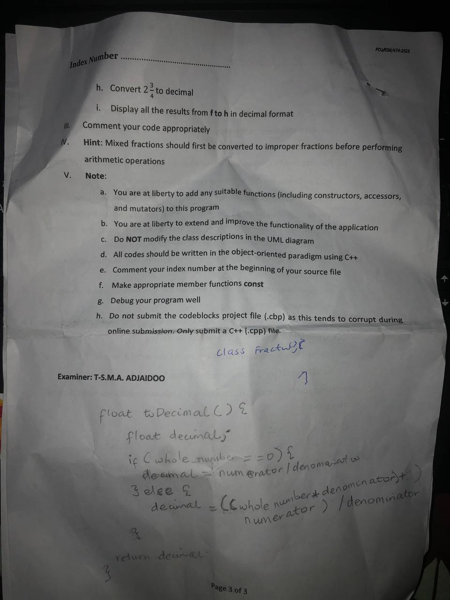
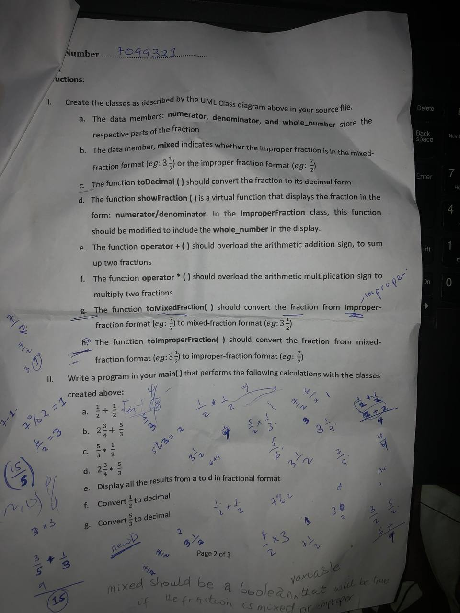
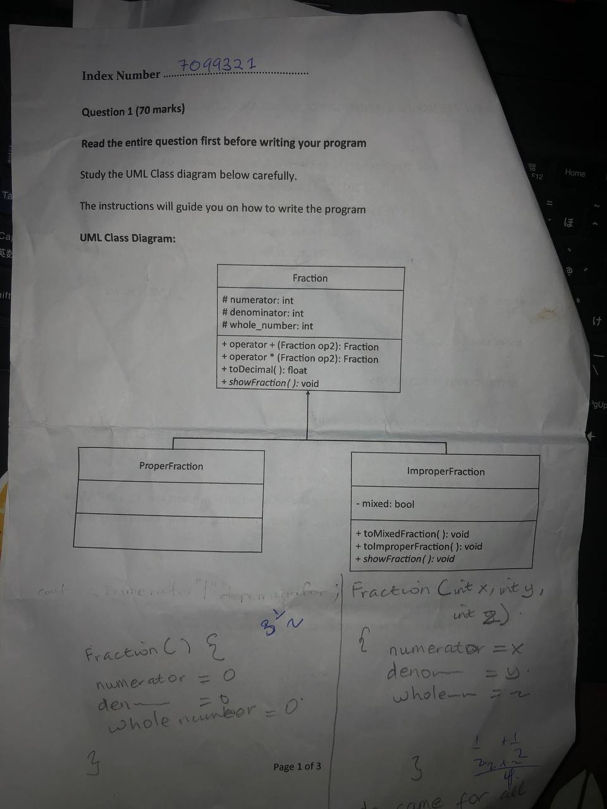

<h1 align="center">Object Oriented Programming with C++</h1>

---

<p align="center"> 
This repository contains the codes to the Object Oriented Programming with C++ taughy by Dr. Theresah - 2023 academic year.
</p>

## 📝 Table of Contents

- [About](#about)
- [Getting Started](#getting_started)
- [Exam](#usage)


## 🧐 About <a name = "about"></a>

This repository contains 5 folder: the *lab_practices* folder, *the personal* folder, the *exam* folder, the *random_questions_from_the_book* folder and the *slide_exercise* folder.
In the the *lab_practices* folder you'll find the des to the weekly lab practice questions. *The personal* folder contains the codes to our semester project, and some personal flies I created when i was learning the OOP. The exam folder contains the cdes to our end of semester exam,*random_questions_from_the_book* folder has the codes to random questions I solved from her recommended book, *slide_exercise* folder has the codes to the exercises from her slides [Please solve those slide questions-Your Midsem questions will me from those slides].

## 🏁 Getting Started <a name = "getting_started"></a>

These instructions will get you a copy of this repository your local machine for development and testing purposes.

Run the code below in your IDE's terminal
```

  git clone https://github.com/gyauelvis/Objected-Oriented-Programming-COE.git

```

## 😎EXAM<a name = "usage"></a>
<p>
  
</p>
 <br>
<br>

*Link to the exam question of the C0E24*

<a href="http://github.com/blackdreamer15/OOP-in-Bytes/blob/main/Misc/final-exam.cpp">Here</a>

Don't forget to share and star this repo. g.elvis here Peace out✌️
